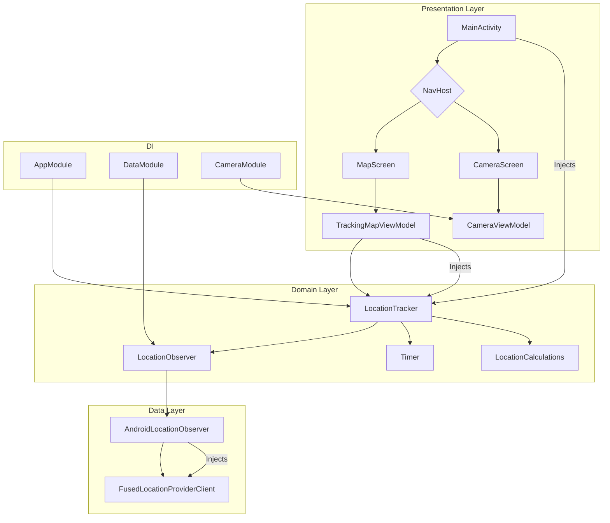

```mermaid
graph TD
    subgraph "Presentation Layer"
        A[MainActivity] --> B{NavHost}
        B --> C[MapScreen]
        B --> D[CameraScreen]
        C --> E[TrackingMapViewModel]
        D --> F[CameraViewModel]
    end

    subgraph "Domain Layer"
        E --> G[LocationTracker]
        G --> H[LocationObserver]
        G --> I[Timer]
        G --> J[LocationCalculations]
    end

    subgraph "Data Layer"
        H --> K[AndroidLocationObserver]
        K --> L[FusedLocationProviderClient]
    end

    subgraph "DI"
        M[AppModule] --> G
        N[DataModule] --> H
        O[CameraModule] --> F
    end

    A -- Injects --> G
    E -- Injects --> G
    K -- Injects --> L
```
